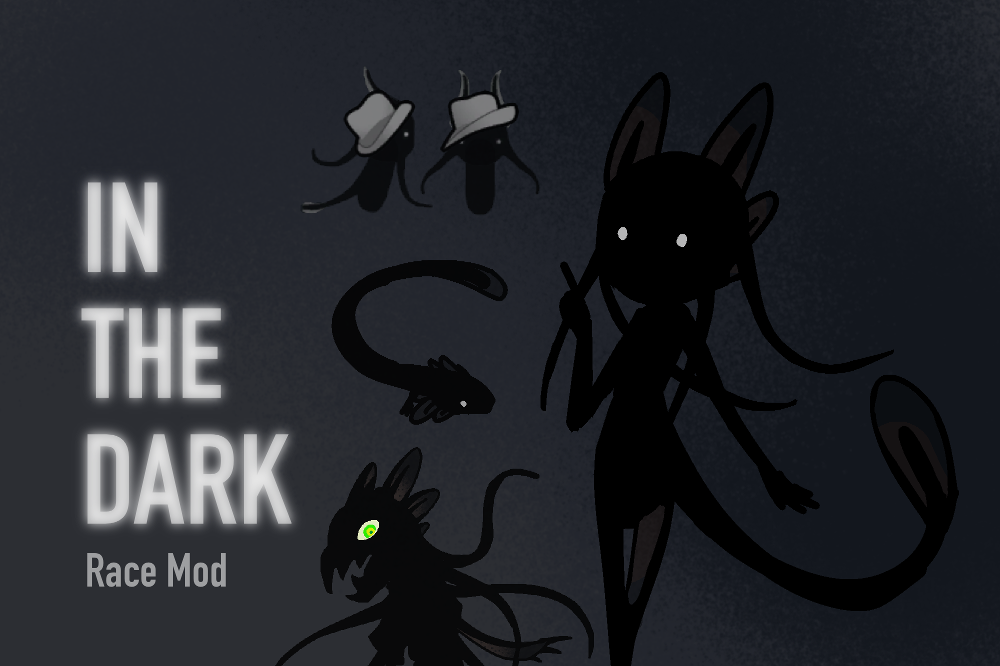

*A RimWorld mod with c# for a coding reference.*
 
~~二刺螈怎么你了~~

Added void spawns, powerful "sea monsters of the cosmos".

We already know RimWorld is based on the Age of Discovery therefore having some mysterious sea monsters is very reasonable.
 
Therefore I created a mass of human parts, tentacles, sirens (a type of aquatic salamander), shadow creatures and nanobots

- You can use my code, but do not use any design (textures/characters/backstories/etc.)

***
TODO
- [x] Thought Sync
- [x] Reproduction (Corruption)
- [ ] Storyteller
- [x] Scenario
- [x] i.essence's side effects
- [ ] Apparel
- [ ] Endgame
- [ ] limited ability use
- [ ] new execution
- [ ] upload to workshop
- [ ] force harvest essence
- [ ] background selection menu